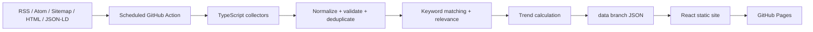

# TrendSignal — Codex Project Definition

## 1. Instruction scope

This file applies to the entire repository and is the authoritative specification for the first release of **TrendSignal**.

Build a working MVP, not only a plan or scaffold. When a detail is ambiguous, choose the simplest solution that respects the mandatory constraints, document the assumption in `README.md`, and continue. Do not invent live endpoints, test results, or successful source validation.

## 2. Product

**TrendSignal** is a keyword-driven market-intelligence website. It regularly indexes public article metadata from major technology companies, consulting firms, AI companies, cybersecurity vendors, and selected specialist media. It detects monitored topics, highlights market trends, and displays articles as searchable cards.

Primary users:
- Consulting and advisory leaders
- Business-development teams
- Technology and cybersecurity leaders
- Market-intelligence and innovation teams

The interface is in **English** (it shipped in French initially; switched on request). Technical names, code, comments, tests, commits, and documentation are in **English**. Translations live in lightweight files — `src/i18n/en.ts` is what the app renders, `src/i18n/fr.ts` is kept complete so the interface can be switched back or offered bilingually. The **data** remains bilingual regardless: keyword and category labels carry both `fr` and `en`, keyword `terms` include French phrases, and French-language sources are collected normally.

Replace any remaining `Veille Pro`, `Insight Track`, or Base44 placeholder branding with `TrendSignal`.

## 3. Mandatory constraints

1. No application backend, API server, database, serverless function, Firebase, Supabase, or equivalent service.
2. The browser reads only static JSON generated in advance.
3. Collection, normalization, scoring, persistence, CI, build, and deployment run through GitHub Actions.
4. Deploy the site to GitHub Pages.
5. Keep source code, configuration, workflows, tests, documentation, and generated data in GitHub.
6. Store generated production data and collector state on a dedicated `data` branch; do not create scheduled data commits on `main`.
7. Never expose GitHub tokens or any secret in the frontend.
8. Shared keywords and sources are modified through Git. Browser toggles are local display preferences only.
9. Do not bypass authentication, paywalls, robots restrictions, anti-bot controls, or access controls.
10. Store public metadata and short plain-text excerpts only, never full article bodies.
11. A failure from one source must not stop all other sources.
12. Treat every external value as untrusted input.

## 4. Architecture



The deployed browser must never scrape publishers directly. It loads:

```text
/data/manifest.json
/data/articles-latest.json
/data/trends.json
/data/statistics.json
/data/sources-public.json
/data/source-health.json
```

Load `manifest.json` first, then use its file map and `generatedAt` as a cache-busting version.

## 5. Required stack

Frontend:
- React, TypeScript strict mode, Vite
- Tailwind CSS
- React Router with `HashRouter`
- Lucide React
- Recharts
- MiniSearch or Fuse.js
- Native `Intl` APIs

Pipeline:
- Node.js and TypeScript
- Native `fetch`
- `rss-parser`
- `fast-xml-parser`
- Cheerio
- Zod
- `p-limit`

Quality:
- npm with committed `package-lock.json`
- `.nvmrc` set to Node 22 unless repository tooling requires a newer supported LTS
- ESLint, Prettier, Vitest, React Testing Library, Playwright
- Do not mix package managers

## 6. Repository structure

Converge toward:

```text
.github/
  ISSUE_TEMPLATE/add-keyword.yml
  ISSUE_TEMPLATE/add-source.yml
  workflows/ci.yml
  workflows/refresh-and-deploy.yml
  dependabot.yml
config/
  categories.yml
  keywords.yml
  sources.yml
docs/
  architecture.md
  adding-a-source.md
  data-model.md
public/
  data/.gitkeep
  images/article-placeholder.svg
scripts/
  adapters/rss.ts
  adapters/sitemap.ts
  adapters/generic-html.ts
  adapters/source-specific/
  collect.ts
  normalize.ts
  deduplicate.ts
  keyword-match.ts
  compute-trends.ts
  compute-statistics.ts
  publish-data.ts
  schemas.ts
  source-health.ts
  generate-demo-data.ts
src/
  components/
  data/client.ts
  data/schemas.ts
  hooks/
  i18n/fr.ts
  i18n/en.ts
  pages/DashboardPage.tsx
  pages/TrendsPage.tsx
  pages/KeywordsPage.tsx
  pages/SourcesPage.tsx
  styles/index.css
  types/index.ts
  App.tsx
  main.tsx
tests/
  fixtures/rss/
  fixtures/sitemap/
  fixtures/html/
  unit/
  e2e/
AGENTS.md
README.md
package.json
package-lock.json
vite.config.ts
tsconfig.json
vitest.config.ts
playwright.config.ts
```

Minor changes are allowed when they reduce complexity. Keep Node-only collector code separate from browser code.

## 7. UI and visual direction

Recreate the Base44 PoC direction:
- White/light background
- Desktop sidebar and mobile drawer
- Dark navy identity and primary buttons
- Clear page title and subtitle
- Thin borders, subtle shadows, rounded cards, generous spacing
- Minimal decorative color
- Three article columns on large desktop, two on tablet, one on mobile

Suggested tokens:

```text
primary #0F172A
text #111827
secondary text #6B7280
border #E5E7EB
muted surface #F8FAFC
success #059669
warning #D97706
error #DC2626
radius 10px-14px
```

Maintain WCAG AA contrast, visible keyboard focus, semantic headings, accessible icon labels, reduced-motion support, and non-color status indicators.

Required routes:

```text
/#/          Dashboard
/#/trends    Trends
/#/keywords  Keywords
/#/sources   Sources
```

### 7.1 Dashboard

Display:
- Title and subtitle
- **Actualiser les données** button that reloads static JSON; it must not claim to trigger collection
- KPI cards: indexed articles, active keywords, active sources, last successful scan
- Optional compact top-trends section
- Search input
- Keyword, source, category, and date filters
- Sort by newest, relevance, or trend
- Responsive article grid
- Loading, empty, error, and stale-data states

### 7.2 Article card

Display:
- Remote image when available; local placeholder on missing/broken image
- Source and company
- Source category
- Matched-keyword badges
- Title
- Plain-text excerpt, maximum 320 characters
- Publication date
- Relevance score when available
- External link

Use lazy image loading and `target="_blank" rel="noopener noreferrer"`. Never render scraped HTML or use `dangerouslySetInnerHTML`.

### 7.3 Trends

Controls:
- 24 hours, 7 days, 30 days
- Category
- Source category

For each trend show:
- Label and status
- Score
- Current volume
- Growth/decline against comparison period
- Distinct source count
- Leading sources
- Related recent articles

Statuses: `Breakout`, `Emerging`, `Rising`, `Stable`, `Declining`.

### 7.4 Keywords

Display French and English labels, category, synonym count, enabled state, last detection, and article count.

A local toggle may hide a keyword from the UI through versioned `localStorage`; label it as a personal display preference. The **Ajouter** action opens the repository's `add-keyword` GitHub Issue form.

### 7.5 Sources

Display source, company, category, homepage, collection method, last attempt, last success, item count, consecutive failures, and health.

Health: `Healthy`, `Warning`, `Error`, `Disabled`.

A local toggle may hide a source from the dashboard only. The **Ajouter** action opens the `add-source` GitHub Issue form.

## 8. Data contracts

Use Zod at generation and browser boundaries. Invalid generated data must not deploy. Dates are ISO 8601 UTC.

```ts
export type SourceCategory =
  | 'consulting'
  | 'technology'
  | 'cybersecurity'
  | 'artificial-intelligence'
  | 'media';

export interface Article {
  id: string;
  title: string;
  url: string;
  canonicalUrl: string;
  sourceId: string;
  sourceName: string;
  company: string;
  sourceCategory: SourceCategory;
  publishedAt: string;
  discoveredAt: string;
  updatedAt?: string;
  summary: string;
  imageUrl?: string;
  language: 'fr' | 'en' | 'unknown';
  matchedKeywordIds: string[];
  relevanceScore: number;
  trendScore?: number;
}

export interface KeywordDefinition {
  id: string;
  labels: { fr: string; en: string };
  category: string;
  terms: string[];
  excludedTerms?: string[];
  weight: number;
  enabled: boolean;
}

export interface PublicSource {
  id: string;
  name: string;
  company: string;
  category: SourceCategory;
  homepageUrl: string;
  collectionMode: 'rss' | 'atom' | 'sitemap' | 'html';
  enabled: boolean;
  priority: number;
}

export interface SourceHealth {
  sourceId: string;
  status: 'healthy' | 'warning' | 'error' | 'disabled';
  lastAttemptAt?: string;
  lastSuccessAt?: string;
  responseTimeMs?: number;
  itemsFetched: number;
  newItems: number;
  consecutiveFailures: number;
  lastError?: string;
}

export interface Trend {
  id: string;
  label: string;
  keywordId: string;
  timeframe: '24h' | '7d' | '30d';
  score: number;
  status: 'breakout' | 'emerging' | 'rising' | 'stable' | 'declining';
  articleCount: number;
  previousArticleCount: number;
  growthRate: number | null;
  distinctSourceCount: number;
  leadingSourceIds: string[];
  relatedArticleIds: string[];
}

export interface DataManifest {
  schemaVersion: string;
  generatedAt: string;
  lastSuccessfulScanAt: string;
  sourceCommitSha?: string;
  dataCommitSha?: string;
  articleCount: number;
  sourceCount: number;
  activeKeywordCount: number;
  files: Record<string, string>;
}
```

Rules:
- Article ID is deterministic, preferably SHA-256 of normalized canonical URL.
- Scores are integers from 0 to 100.
- Public health data must not expose stack traces, local paths, headers, or secrets.
- Sort generated arrays deterministically to avoid noisy commits.

## 9. Configuration

`config/sources.yml` is declarative. Never invent RSS, sitemap, or publication URLs. Validate a live endpoint before setting `enabled: true`; otherwise keep it disabled and document the validation step.

```yaml
schemaVersion: 1
sources:
  - id: microsoft-blog
    name: Microsoft Blog
    company: Microsoft
    category: technology
    homepageUrl: https://blogs.microsoft.com/
    collectionMode: rss
    feedUrl: REPLACE_AFTER_VALIDATION
    enabled: false
    priority: 5
    language: en
    maxItemsPerRun: 30
    includePaths: []
    excludePaths: []
```

`config/keywords.yml` contains bilingual terms:

```yaml
schemaVersion: 1
keywords:
  - id: digital-sovereignty
    labels:
      fr: Souveraineté numérique
      en: Digital sovereignty
    category: cybersecurity
    terms:
      - digital sovereignty
      - data sovereignty
      - cloud sovereignty
      - sovereign cloud
      - souveraineté numérique
      - souveraineté des données
    excludedTerms:
      - political sovereignty
    weight: 1.2
    enabled: true
```

Matching must be case-insensitive and Unicode-aware. Use token/word-boundary matching for short terms such as `AI`, `IA`, and `IAM` to avoid substring false positives.

## 10. Collection pipeline

Implement adapters in this order:
1. RSS and Atom
2. XML sitemap
3. Generic HTML article metadata
4. Source-specific HTML adapter only when needed

Do not use a headless browser in the MVP unless a documented source cannot be supported otherwise.

Metadata extraction priority:
1. JSON-LD `Article`, `NewsArticle`, or `BlogPosting`
2. Open Graph
3. Standard HTML metadata
4. Source-specific selectors

Extract canonical URL, title, publication/updated date, description, image, language, and useful organization metadata only.

Request rules:
- User agent such as `TrendSignalBot/1.0` plus repository URL when known
- 15-second timeout
- At most two transient retries with exponential backoff
- Controlled global and per-domain concurrency
- Conditional requests with ETag and Last-Modified when available
- Persist HTTP cache metadata in the `data` branch
- Limit redirects and response size
- Allow only HTTP and HTTPS

For each source:
1. Record attempt and duration.
2. Catch/classify errors.
3. Preserve last known good articles.
4. Update failure count and health.
5. Continue with other sources.

Fail the run only when configuration or generated data is invalid, the data branch cannot be safely updated, more than 60% of enabled sources fail in a non-bootstrap run, or build/deployment fails.

### 10.1 Normalization and safety

- Strip HTML and scripts from summaries.
- Decode entities and normalize whitespace.
- Limit summary to 320 characters.
- Validate URLs and reject `javascript:`, `file:`, unsupported custom protocols, and external `data:` URLs.
- Do not execute external JavaScript or redistribute full content.

### 10.2 Deduplication

Apply in order:
1. Normalized canonical URL
2. Normalized URL without tracking parameters
3. Same normalized title from the same company within seven days

Remove common parameters: `utm_*`, `gclid`, `fbclid`, `mc_cid`, and `mc_eid`. Do not merge different-company articles only because titles are similar.

## 11. Scoring

### 11.1 Article relevance

Use a deterministic 0-100 model:

```text
Title matches       up to 45
Summary matches     up to 25
Keyword weight      up to 10
Source priority     up to 10
Recency             up to 10
```

Cap at 100. Document the exact formula and test title/summary matching, exclusions, accents, bilingual terms, and word boundaries. Do not use a paid AI API in the MVP.

### 11.2 Trends

Compute during GitHub Actions:

```text
35% normalized publication volume
30% publication acceleration
20% distinct source diversity
15% weighted source authority
```

Compare 24h to previous 24h, 7d to previous 7d, and 30d to previous 30d.

Initial thresholds:

```text
80-100 Breakout
65-79  Emerging
45-64  Rising
25-44  Stable
0-24   Declining when growth is negative, otherwise Stable
```

A `Breakout` requires at least two distinct sources. Handle zero previous volume without division errors and prevent a single low-volume article from becoming a breakout.

## 12. Data branch

Use this layout:

```text
articles/YYYY/MM.json
state/http-cache.json
state/run-history.json
state/source-state.json
generated/articles-latest.json
generated/manifest.json
generated/source-health.json
generated/sources-public.json
generated/statistics.json
generated/trends.json
```

Requirements:
- Keep monthly archives and at least 180 days of metadata where repository size allows.
- Keep the latest 500 relevant articles in `articles-latest.json`.
- Never expose internal collector state through Pages.
- Copy only `generated/` public files to `public/data` during build.
- Create a safe bootstrap path when the `data` branch does not yet exist.

## 13. GitHub Actions

### 13.1 CI

`.github/workflows/ci.yml` runs on pull requests and pushes to `main`:

```text
npm ci
npm run format:check
npm run lint
npm run typecheck
npm run test
npm run build
```

Normal CI must use fixtures and must not depend on live publishers. Run Playwright in a separate job when practical.

### 13.2 Refresh and deploy

`.github/workflows/refresh-and-deploy.yml` runs:
- On push to `main`
- Manually through `workflow_dispatch`
- Every six hours at a non-zero minute, for example `17 */6 * * *`

Useful manual inputs: `full_refresh`, optional `source_id`, and `dry_run`.

Steps:
1. Check out `main`.
2. Install dependencies.
3. Check out or bootstrap `data` in a separate directory.
4. Validate configuration.
5. Collect and isolate source failures.
6. Normalize, deduplicate, match, score, and calculate trends.
7. Generate and validate public JSON.
8. Commit/push `data` when not dry-run.
9. Copy generated public data into `public/data`.
10. Build Vite.
11. Upload the Pages artifact.
12. Deploy to GitHub Pages.
13. Write a summary to `$GITHUB_STEP_SUMMARY` with source counts, failures, new/deduplicated/matched articles, trend count, data SHA, and deployment URL.

Safety:
- Use `GITHUB_TOKEN`, not a PAT, for normal operation.
- Minimize permissions by job.
- Do not trigger refreshes from `data` commits.
- Use concurrency group `trendsignal-refresh-and-deploy` with `cancel-in-progress: false`.
- Use official GitHub actions. Prefer full commit SHAs with version comments; when SHA resolution is unavailable, use stable major tags and document the hardening item.
- Upload warning/error logs as short-retention artifacts.

## 14. GitHub Pages

- Support deployment below a repository subpath.
- Configure Vite base from `VITE_BASE_PATH`.
- Use `HashRouter` so Pages does not need rewrites.
- Do not hard-code owner or repository.
- Derive issue links from `VITE_REPOSITORY_URL` or build-time GitHub variables.

`.env.example`:

```text
VITE_APP_NAME=TrendSignal
VITE_DATA_BASE_URL=./data
VITE_REPOSITORY_URL=
VITE_BASE_PATH=/
```

No runtime secret is required.

## 15. Initial source candidates

These are candidates, not guaranteed endpoints. Validate before enabling.

Consulting priority 1:
- Accenture, Deloitte, PwC, EY, KPMG
- McKinsey & Company, Boston Consulting Group, Bain & Company
- Capgemini, IBM Consulting, CGI, Cognizant

Consulting priority 2:
- NTT DATA, TCS, Infosys, Wipro, HCLTech, DXC Technology
- Oliver Wyman, Roland Berger, BearingPoint, Thoughtworks, Slalom
- Sopra Steria, Eviden, Booz Allen Hamilton

Technology:
- Microsoft, AWS, Google Cloud, IBM, Cisco, NVIDIA, Oracle, SAP
- Salesforce, ServiceNow, Red Hat, GitHub, Cloudflare
- Snowflake, Databricks, MongoDB

AI and cybersecurity:
- OpenAI, Anthropic, Mistral AI, Cohere, Hugging Face
- Palo Alto Networks, CrowdStrike, Fortinet, Zscaler, Okta
- CyberArk, Wiz, Mandiant, SentinelOne, Tenable, Rapid7
- Snyk, Check Point, Proofpoint

Optional media:
- MIT Technology Review, TechCrunch, VentureBeat, Ars Technica, Wired
- InfoQ, The Register, Dark Reading, BleepingComputer, The Hacker News
- BetaKit, IT World Canada

MVP target:
- At least 20 definitions in `sources.yml`.
- At least 8 validated/enabled sources when live validation is possible.
- Other candidates may remain disabled.
- At least one fixture-backed test for each adapter type.
- No fake live articles.

When network access is unavailable, complete the app and fixture-based pipeline, keep endpoints disabled, and document validation steps.

## 16. Initial keywords

Seed bilingual definitions for:
- Artificial intelligence, generative AI, agentic AI
- AI governance, AI security
- Cybersecurity, cyber defense, threat intelligence, ransomware
- Digital sovereignty, data sovereignty, sovereign cloud
- Cloud security, Zero Trust
- Identity and access management, privileged access management
- DevSecOps, platform engineering
- Post-quantum cryptography, quantum computing
- Operational technology security
- Third-party risk management
- Software supply-chain security
- Data protection and privacy engineering

Every keyword needs a stable ID, French and English labels, category, terms, useful exclusions, weight, and enabled flag.

## 17. Local preferences

Use versioned `localStorage` only for hidden keywords/sources, filters, sort order, language preference, and dismissed banners. Handle corrupted values and provide reset. Never store secrets, authentication data, or article bodies.

## 18. Security, performance, and accessibility

- Validate all external and generated data.
- Avoid `dangerouslySetInnerHTML`.
- Use safe outbound-link attributes.
- Do not log cookies, authorization headers, or tokens.
- Add Dependabot for npm and GitHub Actions.
- Add a basic CSP meta policy compatible with Pages.
- Add an attribution note: TrendSignal indexes public metadata, ownership remains with publishers, and users are redirected to original publications.
- Lazy-load images and debounce search.
- Load only latest articles on the initial dashboard; do not ship archives in the first request.
- Target Lighthouse accessibility score 90+ in the MVP environment.

## 19. Tests

Unit-test at least:
- URL normalization and tracking removal
- Deterministic IDs
- RSS, sitemap, JSON-LD, and Open Graph fixture parsing
- HTML stripping and truncation
- Unicode, accents, short-term boundaries, exclusions
- Relevance and trend scoring
- Deduplication
- Zero previous-volume trends
- Source-health transitions
- Zod rejection of invalid data

Component-test:
- Article card with/without/broken image
- Filters and empty/error states
- Source-health badge
- Local preference toggle

Playwright-test:
1. Dashboard loads fixtures.
2. Search and keyword filters work.
3. Trends render.
4. Sources show health.
5. External links use safe attributes.
6. Mobile navigation works.

Live-source tests must not run in normal CI.

## 20. Required npm scripts

Provide these or clear equivalents:

```json
{
  "scripts": {
    "dev": "vite",
    "build": "tsc -b && vite build",
    "preview": "vite preview",
    "lint": "eslint .",
    "format": "prettier --write .",
    "format:check": "prettier --check .",
    "typecheck": "tsc --noEmit",
    "test": "vitest run",
    "test:watch": "vitest",
    "test:e2e": "playwright test",
    "collect": "tsx scripts/collect.ts",
    "collect:fixtures": "tsx scripts/collect.ts --fixtures",
    "generate:demo": "tsx scripts/generate-demo-data.ts"
  }
}
```

## 21. Documentation

`README.md` must include product overview, architecture, prerequisites, install, local development, demo data, fixture/live collection, tests, Pages setup, Actions setup, data-branch bootstrap, source/keyword addition, limitations, and attribution.

Also create:
- `docs/architecture.md`
- `docs/data-model.md`
- `docs/adding-a-source.md`

Never claim that a source works unless validated.

## 22. Implementation order

1. Foundation: React/Vite/TypeScript/Tailwind, strict types, quality tools, responsive shell, routes, translations.
2. UI: deterministic demo JSON, dashboard, filters, cards, trends, keywords, sources, all states.
3. Pipeline: RSS/Atom, sitemap, generic HTML, normalization, deduplication, keyword/relevance/trend logic, source health, fixtures.
4. Persistence: generated public JSON, schema validation, deterministic ordering, data-branch bootstrap/update.
5. Automation: CI, scheduled refresh, Pages build/deploy, summaries, failure isolation.
6. Hardening: accessibility, URL safety, Dependabot, issue forms, documentation, final checks.

## 23. Definition of done

The first delivery must include:
- Working responsive React application in the PoC's visual direction
- Dashboard, Trends, Keywords, and Sources routes
- Demo dataset and static JSON client
- RSS/Atom, sitemap, and generic HTML adapters
- Normalization, deduplication, keyword matching, relevance, trends, health
- Fixture-based tests
- `ci.yml` and `refresh-and-deploy.yml`
- Data-branch persistence/bootstrap
- GitHub Pages deployment configuration
- README and required docs

All must pass:

```text
npm ci
npm run format:check
npm run lint
npm run typecheck
npm run test
npm run build
```

The app must work locally and under a Pages repository subpath. Generated JSON must validate. One failed source must not abort processing. Public files must contain no secrets or stack traces. The worktree must be clean after final commit.

## 24. Non-goals

Do not implement before all MVP requirements pass:
- Accounts, authentication, workspaces, billing
- Email, Slack, or Teams alerts
- Full article storage
- Paid AI summaries, embeddings, vector databases
- Browser-based shared administration
- Browser-triggered Actions using exposed credentials
- Real-time streaming or native mobile apps
- Large-scale headless-browser scraping
- Advanced sentiment analysis

## 25. Coding standards

- Strict TypeScript; avoid `any`.
- Small pure functions for parsing/scoring.
- Functional React components and named exports.
- Business logic outside UI components.
- Validate data at boundaries.
- Clear names, focused files, useful comments only.
- Do not suppress lint/type errors without documented reason.
- Do not commit build output, `node_modules`, credentials, or local caches.
- Preserve useful existing repository content.

## 26. Codex execution behavior

Before editing, inspect repository structure, existing README/package/workflows, and nested instruction files. Determine whether this is a new project or a Base44 migration.

During work:
- Implement incrementally and run targeted tests.
- Do not stop at a plan.
- Do not fabricate live validation.
- Resolve lint, type, test, and build failures.
- Record assumptions and limitations.

Before finishing:
- Run every required command.
- Inspect the production build and Git diff.
- Check workflow YAML and accidental secrets.
- Commit changes and leave a clean worktree.
- Report implementation, commands/tests, validated and disabled sources, limitations, and required GitHub settings.

## 27. Initial Codex task

> Build the first production-ready MVP of TrendSignal from this specification. Implement the static React application, deterministic fixture-based collection pipeline, source and keyword configuration, scoring, tests, GitHub Actions CI, scheduled refresh, data-branch persistence, and GitHub Pages deployment. Do not stop after scaffolding. Run all required checks. When a live source cannot be validated, keep it disabled and document the reason instead of inventing an endpoint or result.
