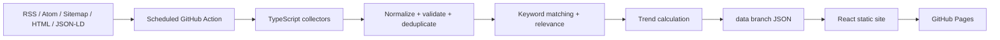

# Architecture

## Overview

TrendSignal has no application backend, API server, database, or serverless function. Everything
that isn't the static React site runs inside GitHub Actions (`.github/workflows/`), reading
`config/*.yml` and writing to the `data` branch. The deployed browser never scrapes a publisher
directly — it only fetches its own already-generated, already-validated JSON.

## Two codebases in one repository

- **`scripts/`** — Node-only. The collection pipeline: HTTP fetching, adapters, normalization,
  deduplication, keyword matching, scoring, trend/statistics computation, and publishing. Runs
  under `tsx` (see `package.json` scripts), never bundled for the browser.
- **`src/`** — Browser-only. The React app. Its only connection to the pipeline is reading the
  JSON files the pipeline publishes, via `src/data/client.ts`.

The two share type/schema _shapes_ (see `docs/data-model.md`) but intentionally keep separate Zod
schema definitions (`scripts/schemas.ts` vs. `src/data/schemas.ts`) so Node-only code never leaks
into the browser bundle.

## Pipeline stages (`scripts/collect.ts`)

1. **Load config** — `config/sources.yml`, `config/keywords.yml`, validated with Zod
   (`scripts/config-loader.ts`).
2. **Fetch** — one adapter per `collectionMode`:
   - `scripts/adapters/rss.ts` (RSS **and** Atom, via `rss-parser`)
   - `scripts/adapters/sitemap.ts` (XML sitemap → per-URL metadata fetch)
   - `scripts/adapters/generic-html.ts` (listing page → per-link metadata fetch)
   - Both sitemap and generic-html delegate metadata extraction to
     `scripts/adapters/html-metadata.ts` (JSON-LD → Open Graph → standard `<meta>`, in that
     priority order).
   - All network access goes through `scripts/http.ts`: 15s timeout, up to two retries with
     exponential backoff on transient errors, ETag/Last-Modified conditional requests, a redirect
     limit, a response-size limit, and an http(s)-only protocol check.
   - Fetching is concurrency-limited globally and per-domain with `p-limit`.
   - **A failure in one source is caught and recorded; it never stops the others** — see the
     per-source `try/catch` in `collect()`.
3. **Normalize** (`scripts/normalize.ts`) — canonical URL normalization (tracking params stripped,
   host lowercased), HTML stripping, 320-character summary truncation, deterministic
   SHA-256-of-canonical-URL article IDs, and a lightweight language guess when the source doesn't
   declare one.
4. **Deduplicate** (`scripts/deduplicate.ts`) — normalized canonical URL → URL with all query
   params stripped → same normalized title from the same company within 7 days, in that order.
5. **Keyword match + relevance score** (`scripts/keyword-match.ts`, `scripts/scoring.ts`) —
   Unicode-aware, case-insensitive, word-boundary matching (so short terms like `AI`/`IA`/`IAM`
   don't match as substrings), with `excludedTerms` support; then a documented deterministic 0–100
   relevance score.
6. **Trends** (`scripts/compute-trends.ts`) — one entry per enabled keyword × timeframe (24h/7d/
   30d), weighted volume/acceleration/diversity/authority score, with a `Breakout` guard requiring
   ≥2 distinct sources and ≥2 articles.
7. **Statistics** (`scripts/compute-statistics.ts`) — per-category and per-keyword counts for the
   dashboard KPIs and the Keywords page.
8. **Source health** (`scripts/source-health.ts`) — per-source status transitions
   (`healthy → warning → error`, or `disabled`) plus a sanitized error message (no stack traces, no
   local paths, no headers/tokens).
9. **Publish** — every generated file is Zod-validated again before being written
   (`scripts/collect.ts`), and a second, independent validation gate runs at
   `scripts/publish-data.ts` right before the files are copied into `public/data/` — invalid
   generated data can never reach the deployed site.

## Data branch

Generated production data and collector state live on a dedicated `data` branch (never on `main`),
laid out as described in `docs/data-model.md`. `refresh-and-deploy.yml` checks it out into a
separate worktree, bootstrapping an orphan `data` branch on the very first run if it doesn't exist
yet.

## Frontend

- React + TypeScript (strict) + Vite + Tailwind CSS.
- `HashRouter` — no server rewrite rules needed under a GitHub Pages subpath.
- `src/data/client.ts` loads `manifest.json` first, then uses its `files` map and `generatedAt` as
  a cache-busting query param for the rest.
- `src/hooks/useLocalStorage.ts` — versioned, corruption-tolerant local storage for personal
  display preferences only (hidden keywords/sources, filters, sort, locale). Never used for
  anything that needs to be shared or trusted.

## Fixture-backed testing

`scripts/fixture-server.ts` serves the files under `tests/fixtures/**` over a real, ephemeral
`127.0.0.1` HTTP server, so the actual network-fetching adapters (not a mocked stand-in) are
exercised by both `npm run test` (Vitest) and `npm run collect:fixtures` /
`npm run generate:demo` — without ever contacting a live publisher.
